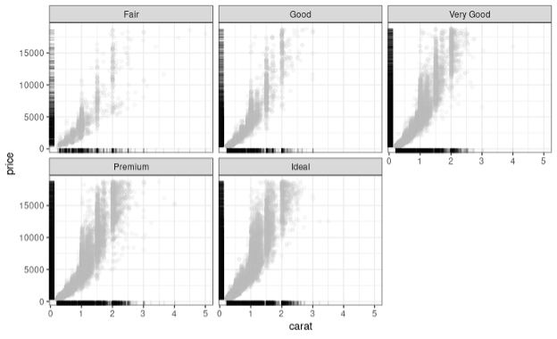
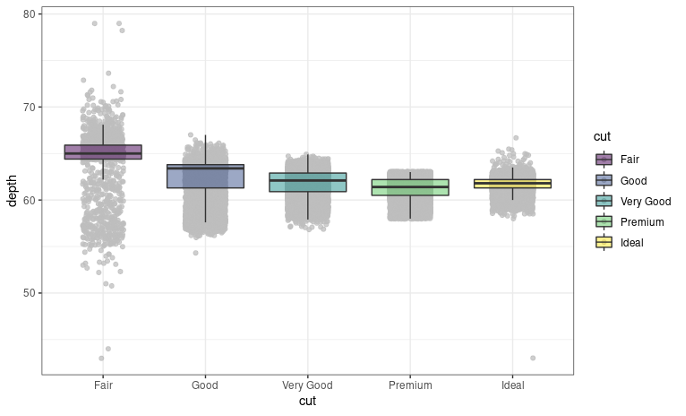
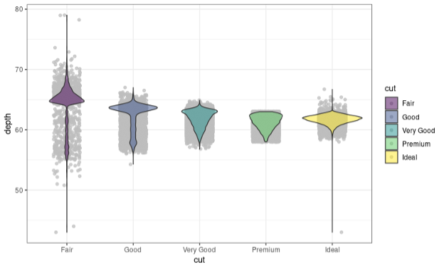
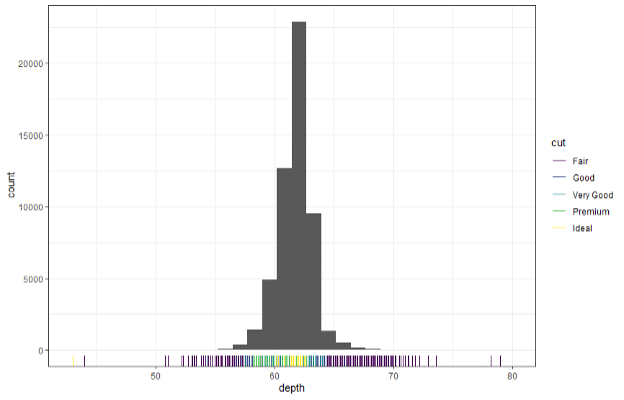

# Assignment #1

For this assignment, you will be analyzing the diamonds data frame included in the tidyverse package, which contains 53,930 observations on 10 features related to diamonds. The goal of this assignment is to become more familiar with R, and so you will need t¬o use resources such as the ggplot2 cheat sheet on Canvas and help menus in R to learn how to make different types of plots. Provide all responses in the designated spaces in this Word document, then save it as a pdf and upload it to Canvas. 

1.	[10%] Generate a jittered scatterplot of diamond price as a function of diamond weight that is broken into five sub-panels across two rows, in which each sub-panel represents a different cut quality. Set the color of the points to gray with a transparency alpha value of 0.1, and the background to white rather than the default color of gray.

2.	[5%] What is a rug plot, and what geometric layer (function) in ggplot2 can be used to generate one?

3.	[10%] Add a rug plot to the figure from question 1.

4.	[20%] Provide the code to generate the following figure, in which the bands around the fitted colored lines are 95% confidence intervals.

5.	[5%] In the figure from question 4, does there appear to be a relationship between diamond price and diamond weight? If there is a relationship, then what is it?

6.	[5%] In the figure from question 4, why are the confidence intervals much narrower for diamonds weighing less than three carats than for those weighing more than three carats?

7.	[5%] Use the code provided below to create a box plot without outliers. Note that the argument outlier.shape = NA to remove outliers from the plot.  

8.	[5%] In your plot from question 7, the x axis is categorical. Therefore, what is the purpose of the following piece of code?

9.	[5%] What is a violin plot, and what geometric layer (function) in ggplot2 can be used to generate one?

10.	[5%] How are violin plots different from box plots?

11.	[10%] Replace the box plots with violin plots in the figure from question 7, giving them the same level of transparency as the box plots.

12.	[15%] Provide the code to generate the following plot.

