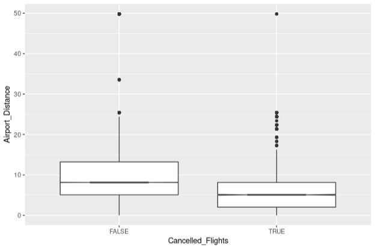
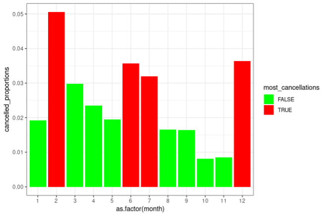
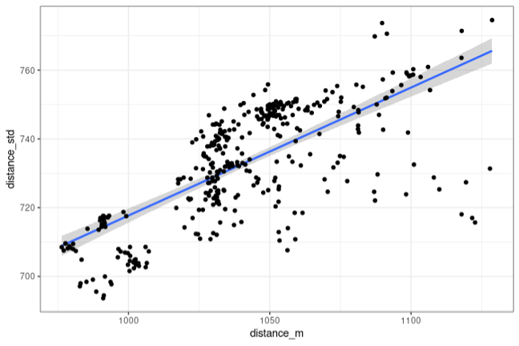

# Assignment #2

For this assignment you will be analyzing the flights data frame included in the nycflights13 package, which contains 19 features for 336,776 flights that departed from New York City in 2013. The goal of this assignment is to become more familiar with data transformations and exploratory data analysis. Provide all responses in the designated spaces in this Word document, then save it as a pdf and upload it to Canvas. 

1. [25%] Generate notched boxplots to compare distributions of airport distances between canceled and non-canceled flights. Is the median airport distance for canceled flights shorter, longer, or roughly the same as for non-canceled flights? Justify your answer, and then provide a possible explanation for this finding. 

2. [40%] Generate a bar plot with month on the x axis and the proportion of the month’s flights that are canceled on the y axis. Which four months of the year had the highest proportions of flight cancelations? Provide a possible explanation for this finding. 

Note: You will need to use the function geom_col() to generate a bar plot for which you provide the x and y axis features. Because geom_col()expects that the feature on the x axis is categorical, you must also use the code as.factor(month) to convert the month feature to a categorical variable taking 12 values (1, 2, …, 12).

3.	[35%] Generate a scatterplot displaying the relationship between the mean and the standard deviation of airport distance for flights on each of the 365 days of the year. Use the method argument of the geom_smooth() function to overlay your scatterplot with a fitted straight line with confidence intervals. Is there a relationship between the mean and standard deviation of airport distance for flights on each day of the year? Describe the relationship (or lack of one), and then provide a possible explanation for this finding. 

