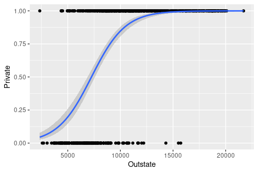

# Assignment #3

For this assignment you will be analyzing the College data frame included in the ISLR package, which contains 18 features for 777 U.S. colleges obtained from the 1995 issue of U.S. News and World Reports. The goal of this assignment is to become more familiar with linear and logistic regression. All analyses must be performed in R using tidyverse and other packages discussed in class. Provide all responses in the designated spaces in this Word document, then save it as a pdf and upload it to Canvas. 

1.	[5%] Recode the binary feature Private with the value 0 in place of No and the value 1 in place of Yes, and store it in a new data frame called College.recoded.

2.	[10%] Fit a multiple linear regression model to predict Private from the 17 other features. Print a summary of the model output to the console. Which feature is most statistically important in this model, and how do you know? 

3.	[6%] Fit a simple linear regression model to predict Private from the most statistically important feature you identified in question 2. Print a summary of the model output to the console. Is the feature from question 2 still statistically important, and how do you know? 

4.	[10%] Visualize the simple linear regression model from question 3 on a scatterplot. 

5.	[10%] Use the simple linear regression model from question 3 to predict classes for the training data. Add these predictions to the data frame College.recoded from question 1. Print a confusion matrix and an estimate of classification training accuracy to the console. 

6.	[12%] Perform the same operations as in question 5, except using the multiple linear regression model from question 2. Is the performance of the multiple linear regression model better, worse, or the same as the simple linear regression model? Justify your answer, and then provide a reason for your finding. 

7.	[10%] Fit a multiple logistic regression model to predict Private from the 17 other features. Print a summary of the model output to the console. Which feature is most statistically important in this model, and how do you know? 

8.	[5%] Fit a simple logistic regression model to predict Private from the most statistically important feature you identified in question 7. Print a summary of the model output to the console. Is the feature from question 7 still statistically important, and how do you know? 

9.	[10%] Visualize the simple logistic regression model from question 8 on a scatterplot. 

10.	[10%] Use the simple logistic regression model from question 8 to predict classes for the training data. Add these predictions to the data frame College.recoded from question 1. Print a confusion matrix and an estimate of classification training accuracy to the console. 

11.	[12%] Perform the same operations as in question 10, except using the multiple logistic regression model from question 7. Is the performance of the multiple logistic regression model better, worse, or the same as the multiple linear regression model? Justify your answer, and then provide a reason for your finding.
