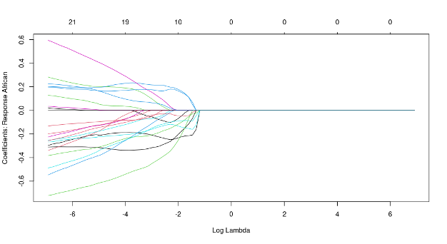

# Assignment #4

For this assignment, you will be analyzing the GlobalAncestry.csv dataset on Canvas, which contains information on the ancestry and 8916 genetic variants of 242 individuals.  
 
The first column in the dataset, labeled ancestry, provides the ancestry of each individual: 

- African 	 	 	     San and Yoruban individuals from sub-Saharan Africa 
- European 	 	 	     Italian and Russian individuals from Europe 
- EastAsian  	 	     Chinese and Japanese individuals from East Asia 
- Oceanian 	 	     	 Melanesian and Papuan individuals from Oceania 
- NativeAmerican     Pima and Mayan individuals from the Americas 
- Mexican 	 	 	     Mexican individuals from the Americas 
- Unknown1 	 	 	     Unknown ancestry 
- Unknown2 	 	 	     Unknown ancestry 
- Unknown3 	 	 	     Unknown ancestry 
- Unknown4 	 	 	     Unknown ancestry 
- Unknown5 	 	 	     Unknown ancestry 
 
As in the example from our introductory lecture in the course, the remaining columns provide the number of copies (0, 1, or 2) of 8916 genetic variants.  
 
The goal of this assignment is to become more familiar with model selection, feature selection, and regularization. All analyses must be performed in R using the tidyverse and glmnet packages discussed in class. Provide your responses in the designated spaces in this Word document, then save it as a pdf and upload it to Canvas.  
 
Brief overview of the assignment: 
The objective of this assignment is to train a multinomial regression classifier to predict K=5 ancestries (African, European, EastAsian, Oceanian, and NativeAmerican) from genetic data. The training dataset will consist of all individuals with known ancestries (African, European, EastAsian, Oceanian, and NativeAmerican), and the test dataset will consist of the five individuals with unknown ancestries (Unknown1, Unknown2, Unknown3, Unknown4, and Unknown5). The best classifier will be determined by lassopenalized multinomial regression and 10-fold cross-validation applied to the training dataset. As in our lecture on this topic, you will consider 100 tuning parameter values (λ) evenly spaced between 0.001 and 1000 on a base-10 logarithmic scale, and will choose the simplest classifier that is within 1 standard error of the best classifier. You will then use this classifier to predict the ancestries of the five unknown individuals in the test dataset from their genetic data.  

Note: When using glmnet, do not recode ancestry values as 1, 2, 3, etc. We only did this in class to illustrate the connection with using linear regression applied to a response with values 0 and 1, as linear regression requires a quantitative response.  
1.	[15%] Load the GlobalAncestry.csv dataset using the approach outlined for the Advertising.csv dataset in our linear regression lecture, and then create the following two data frames: 
    -	Training data frame called train, which only includes observations with ancestry values African, European, EastAsian, Oceanian, and NativeAmerican.  
    -	Test data frame called test, which only includes observations with ancestry values Unknown1, Unknown2, Unknown3, Unknown4, and Unknown5. 
    
2.	[25%] Apply glmnet to the training dataset train from question 1 to train a lasso penalized multinomial regression classifier to predict ancestry from the 8916 genetic variants. Consider 100 tuning parameter (λ) values evenly spaced between 0.001 and 1000 on a base-10 logarithmic scale. Plot the regression parameter estimates (coefficients) for each of the K=5 classes as a function of log(λ). Based on these results, does it appear that regularization and feature selection are both working? Briefly explain your answer. 

Note: There will be a distinct set of regression coefficients for each of the K=5 classes, and so you must provide five graphs. You can access each graph with the back and forward arrows under the “Plots” subpanel in RStudio. You also do not need to plot a legend on each graph, as there are too many potential lines (up to 8917) to make a legend feasible. 

3.	[20%] Apply glmnet to the training dataset train from question 1 to perform 10-fold cross-validation for a lasso-penalized multinomial regression classifier to predict ancestry from the 8916 genetic variants, again considering 100 tuning parameter (λ) values evenly spaced between 0.001 and 1000 on a base-10 logarithmic scale. Plot the cross-validation error as a function of log(λ). What is the best λ value, and what λ value is associated with the simplest model that is within 1 standard error of the best model? 

4.	[20%] Apply glmnet to the training dataset train from question 1 to train a lasso penalized multinomial regression classifier to predict ancestry from the 8916 genetic variants, using the tuning parameter (λ) value that is associated with the simplest model within 1 standard error of the best model from question 3. Next, apply this fitted model to the training data to predict ancestry, and create a new data frame that contains the training data along with these predictions. Last, print a confusion matrix and an estimate of classification training accuracy to the console.  

5.	[20%] Apply glmnet to the test dataset test from question 1 to predict ancestry for each of the five individuals with your trained model from question 4. Report the estimated ancestries for each of the five individuals.  
